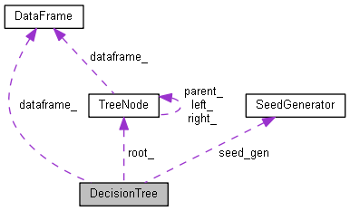
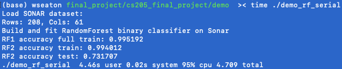
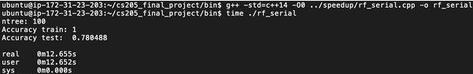
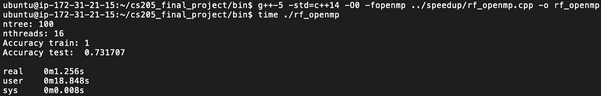
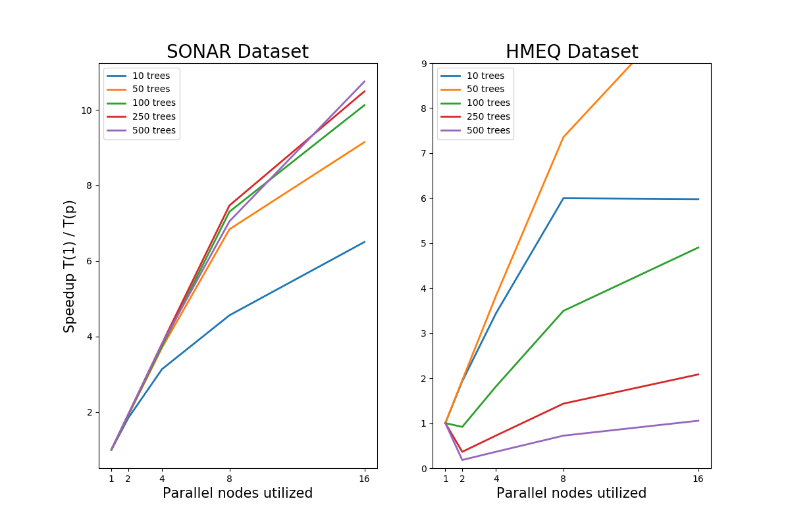
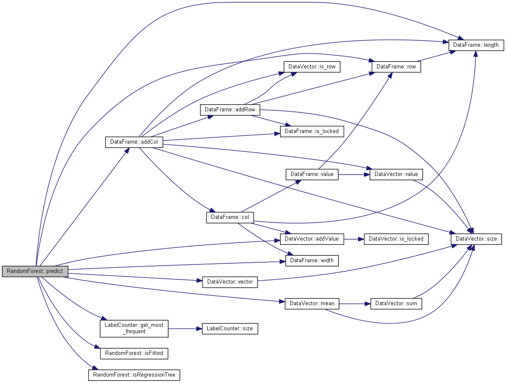

# Decision Tree Parallelization in C++
#### CS205: Computing Foundations for Computational Science
Harvard School of Engineering and Applied Sciences
Spring 2020

**Team**: Gabriel Pestre, Johannes Kolberg, Hardik Gupta, Will Seaton

### Summary
Supervised learning in today's high performance computing industry can require high computational costs and extended time during model training or prediction. Identifying methods to speed up supervised learning will be a critical innovation path in coming years. A recent Stanford study quantified a new Moore's Law for AI by calculating that compute available for model training has been doubling every 3.4 months compared with every two years for processor development.([1](https://www.computerweekly.com/news/252475371/Stanford-University-finds-that-AI-is-outpacing-Moores-Law "Computer Weekly")). That same study said the time reduction to train ResNet image classification dropped from three hours in late 2017 to 88 seconds in mid-2019. Accelerating model training at all levels will unlock new capacity for data science and machine learning to help important problems or decrease necessary cost and time enough to provide greater access.

To participate in this innovation, we wanted to assess the speed up possible by parallelizing various parts of some of today's most relied upon supervised learning models - decision trees and random forest. Because of the nature of these models, there are various places where parallelization can be applied for potential speed up. These locations include training, loss calculation, pruning, prediction and tuning.

#### Decision Trees: Non-Linear Machine Learning Models
Decision trees are a popular and well-established family of non-linear models used extensively in data analysis and machine learning predictions. Basic Classification And Regression Trees (CART) can achieve decent results, but are limited by fitting a single tree structure to the problem. They are prone to overfitting and separate trees fitted on the same data tend to be highly correlated.

An extension to simple CARTs fitted on the training data is to "bootstrap" new samples and fit a separate tree on each. This creates an ensemble that aggregates predictions into an overall mean value for regression problems or mode value for classification. Bootstrap Aggregating, or "bagging", produces several trees fitted on variations of the original training set and such an ensemble leads to generally better performance on unseen held-out data.

The bagged trees are still fitting to the same data so they remain correlated. Overfitting gets worse the more trees in the ensemble model. Each bootstrapped tree can over rely on comparatively predictive variables, further diminishing the variability and thus generalizable accuracy that can be achieved.

#### Random Forest: Decision Trees + Bootstrapping + Random Subsetting
Random Forest models are an improvement over decision trees because each tree considers a random subset of predictors when calculating the best node split. The tree structures vary to a greater extent, making them less likely to overfit even at higher number of trees.

The trade off is that random forests have more available unique tree types if you make subsets available and computational costs can quickly skyrocket. As the dataset grows, the cost of fitting each tree does too. The benefit in accuracy from fitting more trees remains high though, so despite the increasing costs from increasing data and number of trees, a data scientist still must pursue this route.

#### Fitting the Trees to the Forest
Since each tree is an independent structure, it can be fitted separately and is therefore an excellent candidate for parallelization. Each tree bootstraps a new training sample and recursively splits nodes until some stopping criteria is met. Fitting a hundred trees can theoretically be done in the same time as fitting a single one, provided one has sufficient parallel resources available.

Fitting each tree requires considering many values as the optimal location to split at and this loss calculation can also be parallelized. At each value, the model must calculate an independent loss value before collating results and selecting the minimum loss.

Lastly, due to the nature of bootstrap resampling and random selection of subsets of predictors, random forests can be difficult to reproduce.  Popular libraries like sklearn and caret are not guaranteed to reproduce identical results even with the same seed. This is a challenge when making speed up experiments reproducible, a pillar of effective computational science.

## Code Base Design
We built from the ground up C++ classes for data integration and manipulation. Since this was all of our first time implementing a project in C/C++, this allowed us to have greater control over parallelization options at every level. We parallelize using OpenMP.

### Project Structure
```plaintext
├───bin
│       compile.sh
│
├───data
│       cancer_clean.csv
│       cancer_data_notes.txt
│       hmeq_clean.csv
│       hmeq_data_cleaning.txt
│       sonar.all-data.numerical.csv
│
├───demo
│       demo_rf_serial.cpp
│
├───docs (by Doxygen)
│
├───scripts
│       print-config-c.sh
│       print-config-general.sh
│       print-config-mpi.sh
│
├───speedup
│       rf_openmp.cpp
│       rf_openmp_hmeq.cpp
│       rf_serial.cpp
│       rf_serial_hmeq.cpp
│
├───src
│       datasets.cpp
│       datasets.hpp
│       decision_tree.cpp
│       decision_tree.hpp
│       losses.cpp
│       losses.hpp
│       metrics.cpp
│       metrics.hpp
│       random_forest.cpp
│       random_forest.hpp
│       tree_node.cpp
│       tree_node.hpp
│
├───src-openmp
│       decision_tree.cpp
│       decision_tree.hpp
│       random_forest.cpp
│       random_forest.hpp
│
└───tests
```

## Class Structure
#### Data Structures:
The **DataVector**, **DataFrame**, and **DataLoader** classes are used for data management.
They provide some functionality helpful for decision trees (e.g. splitting a data frame into two frames based on a splitting column and threshold) but none of the logic for training a tree.

All values are stored as doubles. Negative indexing is permitted.

The **TreeNode** class implements a basic tree structure. The nodes have storage for data relevant to decision trees (e.g. training data, splitting values), but none of the logic for training those splits. Each node has a height (number of levels in the subtree rooted at this node, including this level) and a depth (distance between this node and root node, where root node has depth zero). Thus, for any node, the sum of its height and depth should be equivalent to the height of the tree it is in.

The **LossFunction** and **LabelCounter** classes are helpers for the decision tree.
For classification, the loss functions take in a vector of (true) labels. The predicted label is not passed because it is implicit (majority label, with ties broken in favor of smallest label).
For regression, the loss functions take in a vector of (true) values. The predicted value is not passed because it is implicit (mean value).

The label counter stores the labels in a map (where each key is a label and each value is the number of occurrences of that label). Although they are stored as doubles, the labels are assumed to have integer values. Labels are coerced to integers when they are added to the map. Non-integer labels will cause an assertion error.




__(Diagram generated with [doxygen](http://www.doxygen.nl/).)__

#### Algorithms:
The **DecisionTree** class implements classification and regression trees.
Assumes the class is stored in the final column (accessible with column index `-1`).
It is initialized with a dataset, which is placed in a new TreeNode and serves as the root.
The fitting process recursively visits leaf nodes, checks for stopping/pruning conditions, and potentially performs a new split.

When a new split is added, the splitting column and threshold are stored in the splitting node, and new child nodes are created, each with their respective portion of the dataset.
When initialized, nodes in the decision tree typically have a piece of the dataset, but no splitting values (column+threshold); the latter are not set until the node is actually visited by the recursive fitting function.

The **RandomForest** class implements the random forest algorithm.
It creates a series of **DecisionTrees** and fits each one on a bootstrapped sample of the dataset. It allows a number of hyperparameters, so of which it delegates to the **DecisionTrees**.

#### Import conventions:
- Header files (`.hpp`) only import other header files.
- Class files (`.cpp`) that don’t have a `main` method only import header files.
- Class files (`.cpp`) that do have a `main` method import all relevant class files (but never another class file that has a `main` method).
#### Naming conventions:
- "set_" and "add_" methods modify the object.
- "get_" methods return a constant or pre-computed attribute of the object without modifying it.
- "find_" methods calculate something about the object without modifying it.
- Utility methods (public or private) are helpers that may or may not modify the object (as indicated in the docstring).
#### Parameter conventions:
Generally, vectors are returned as pointers. Data frames are sometimes returned as pointers (\*), especially for functions that return multiple frames (i.e. a vector of pointers to data frames).
Objects are rarely passed by reference (&) except if it was necessary to achieve functionality.

## Salient Design Choices
#### Use of abstract data structures:
We decided to define our own **DataVector** and **DataFrame** data types in order to ensure consistency in our data manipulations and make it easier to unit-test the code. For example, the **DataFrame** class contains a method that inspects values in a specified column and splits the rows into two new **DataFrames** depending on whether the values are above or below a specified threshold value. We also chose this approach because we were interested in seeing whether we could achieve speed up by introduction parallelism at the data-structure level (e.g. by unrolling some of the loops in the **DataFrame**’s helper functions).
#### Use of nested algorithms
We decided on a modularized approach for implementing the random forest algorithm:
We defined a **TreeNode** class to handle tree traversal operations and data storage operations: each node in the tree stores a subset of the training data (i.e. the collection of observations that have been routed to that node in the decision tree based on previous splits), as well as the results of the splitting operation (i.e. which column to split on and what threshold value to use).

We defined a **DecisionTree** class to implement the fitting algorithm, which loads the full training set into its root node, and recursively looks for the best split and generates left and right child **TreeNode** accordingly.

We defined a **RandomForest** class to create a series of **DecisionTree** objects, fit each one on a different version of the dataset (using bootstrapped sampling), and make predictions based on the ensemble results.
We felt this approach would make it easier to verify the accuracy of our results, and also facilitate comparisons to figure out where parallelization is most effective.
#### Delegation of hyperparameters:
Vanilla decision trees always consider all features to find the best split at each node, which is why they tend to be highly correlated. Trees in Random Forests use a randomly selected subset of features at each split, to reduce correlation. Our **RandomForest** constructor takes a hyperparameter (`mtry`) for choosing a random subset of features at each split. Since the **RandomForest** class delegates the tree fitting process to the **DecisionTree** class, we allowed decision trees to take an `mtry` hyperparameter. However, when we used decision trees on their own, we imposed `mtry==num_features_` in order to prevent randomness in the vanilla version.
#### Use of randomness:
A number of subroutines in our algorithm use a random seed to introduce randomness in a repeatable way. Some routines (such as **RandomForest**’s `fit` method), use a randomized procedure that invokes other random elements. We decided to implement a **SeedGenerator** object to produce a pseudorandom but repeatable sequence of seeds, such that the encompassing algorithm (e.g. **RandomForest**`.fit()`) can be given a meta-seed to generate the seeds it uses for other non-deterministic algorithms (e.g. **DecisionTree**`.fit()`) in a repeatable way.

#### Dependencies
Our code is written in C++14. We use some standard libraries listed below but do not use any external packages.


## OpenMP Parallelization
The `src-openmp` directory contains parallelized versions of the baseline serial codebase.

`random_forest.cpp` has a parallelized version of `RandomForest.fit()` which distributes the fitting of separate trees across threads. This is where most of the performance gains come from, as now `num_threads` trees are being fitted at any given time rather than a single one.

`decision_tree.cpp` contains a parallelized version of `predict()` and `findBestSplit()`. Each random forest constituent tree is of the type DecisionTree, so further gains from parallelization can be achieved here. The `fit()` method is not parallelized, as it makes recursive calls to evaluate splits, and though we could parallelize different branches of the splitting process rather than greedily going left to right, the sequential portion of the code means the additional overhead would quickly outweigh the added computational power from parallelization. The `predict()` method, however, simply loops through the input observations to make a prediction for each, which is an obvious candidate for parallelization. A bottleneck is that the combining of resultant predictions must be done in the right order, which slows it down a bit.

Finally, `DecisionTree.findBestSplit()` is called every time a new split is evaluated in a tree. It searches the pool of candidate predictors to use as splits and evaluates all unique values of each to be used as the splitting criteria. This is an increasingly expensive task as the dataset grows. This is also parallelized such that different threads evaluate different subsets of the candidate space of split criteria, which noticeably improves training time, especially in combination with parallelized `RandomForest.fit()`.

Parallelizing Random Forest’s prediction method proved difficult as it relies heavily on recursive use of our custom data structures, which was not 100% reliable with OpenMP pragmas. After extensive experimentation, we opted not to parallelize the `RandomForest.predict()` method, which ultimately does not matter much as the method is already very fast in serial execution; prediction is not the expensive part.

Our design choice to implement custom `DataVector` and `DataFrame` classes helped tremendously in handling data, but proved to be a challenge when parallelizing. In particular, OpenMP performs a lot of pre-allocation, creation, and deletion of objects under the hood, which requires a very thorough implementation of any custom classes and data structures. As such, when parallelizing using OpenMP pragmas, we usually avoided using our custom data structures where possible, instead using atomic types or standard objects from the `std` namespace. This was not a problem per se, but meant that parallelization did not merely consist of adding pragmas, but required some comprehensive refactoring. Consequently the OpenMP-parallelization took a lot longer than anticipated, impacting our stretch goals.

### Alternative parallelization techniques considered
#### Loop Unrolling
Our design leaves limited opportunities for loop unrolling. The primary target was in unrolling loss calculations. Our experiments found that as expected this had no material impact on training speed and was thus not incorporated in the final design. We have kept our loop unrolling code in branch `unroll` for review by those that might be interested.

#### OpenACC
We did not prioritize this approach because we felt decision tree algorithms would not be amenable to GPU parallelization: the decision tree’s fitting algorithm relies extensively on branching and control flow statements, making it much more appropriate for CPUs. We considered GPU acceleration of DataVector and DataFrame operations but given how often these are called by other parts of the code base, we expect large overheads.

#### MPI
MPI is distributed-memory message-passing parallelization. Our DataFrame is merely a collection of pointers to underlying DataVector rows, such that data is not unnecessarily copied and moved around. This makes data handling much faster, but also less suited to distributed-memory parallelization. Since MPI passes messages around, there seems to be no convenient way to send entire tree structures between nodes. A more promising avenue is using MPI to parallelize the hyperparameter search. Implementing a robust grid search methodology was a stretch goal that must remain for now in Future Work, but MPI shows more promise for this problem.


## How to Run Demo
To run our Random Forest demonstration locally, please run the below commands in your Terminal. Please ensure you are using a version of C++ compatible with c++14.
```plaintext
// Clone our repository locally
$ git clone https://github.com/johannes-kk/cs205_final_project.git

// Navigate to Demo folder
$ cd cs205_final_project/demo/

// Compile the demo file
$ g++ -std=c++14 -O0 demo_rf_serial.cpp -o demo_rf_serial

// Run the executable
$ time ./demo_rf_serial
```
Expected Output:



## Experimental Design

#### Datasets
We use three open-source machine learning datasets with varied characteristics for development, testing, and our experimentation.

The Sonar dataset is a binary classification problem of discriminating between sonar signals bounced off metal cylinders versus roughly cylindrical rocks. We change the class column from a string to numerical, but otherwise use the dataset as-is. It only has a couple hundred observations, so it is mostly used for development and testing.

Dataset link: https://archive.ics.uci.edu/ml/datasets/Connectionist+Bench+(Sonar,+Mines+vs.+Rocks)

The HMEQ dataset contains loan performance information for 5,960 home equity loans (down to 3,445 observations after removing rows with missing values). For each loan, there are 12 predictors including loan amount, mortgage balance, and length of credit report. We dropped a predictor variable that represented the job category of the borrower because our implementation does not handle multi-class categorical variables yet. The target variable is a binary variable indicating whether a loan eventually went bad (defaulted / seriously delinquent). This adverse outcome occurs in 20% of the cases.

We used the HMEQ dataset for testing the speedup achieved by our implementation.

Dataset link: https://www.kaggle.com/ajay1735/hmeq-data

The Cancer dataset is taken from a homework assignment from the Harvard Fall 2019 course AC209a (Data Science I). Each observation corresponds to a tissue sample from a patient with one of the two forms of leukemia. The target variable represents the cancer type, with 0 indicating the acute lymphoblastic leukemia (ALL) class and 1 indicating the acute myeloid leukemia (AML) class. The original dataset had 750 observations and expression levels of 7,129 different genes. For our testing, we reduced the number of predictors to only the first 30 genes.

#### Cloud Infrastructure
We utilize an Amazon Web Service m5.4xlarge instance for our parallel implementation tests. Our instance was running Ubuntu Server 16.04 with 16 vCPUs, 64 GiB Memory and EBS Storage. We were able to leverage 2 threads per core and 8 cores for the single socket. The CPU was an Intel Xeon Platinum 8259CL with 2.5GHz, L2 cache of 1024K and L3 cache of 36608K.

#### Reproducibility
To run our code on your own AWS instance, please follow these commands.

Install the compiler
```plaintext
$ sudo apt-get install software-properties-common
$ sudo add-apt-repository ppa:ubuntu-toolchain-r/test
$ sudo apt-get update
$ sudo apt-get install gcc
$ sudo apt install g++
```

Run our code
```plaintext
Clone our repository
$ git clone https://github.com/johannes-kk/cs205_final_project.git
Navigate to the bin folder
$ cd cs205_final_project/bin/
Compile the demo file (serial execution)
$ g++ -std=c++14 -O0 ../speedup/rf_serial.cpp -o rf_serial
Run the executable
$ time ./rf_serial
```

Output preview:



```plaintext
Compile the demo file (parallel execution)
$ g++-5 -std=c++14 -O0 -fopenmp ../speedup/rf_openmp.cpp -o rf_openmp
[Note: On an Ubuntu 16.04 AWS instance, `sudo apt install g++` installs g++-5. Our code will compile successfully using g++-5 as well.]
Run the executable
$ time ./rf_openmp
```

Output preview:




To change number of threads

    $ export OMP_NUM_THREADS=8

To change number of trees, edit variable `int ntree = 100;`

    $ vim ../speedup/rf_openmp.cpp


## Speed Up Achieved
Our parallel implementation achieved overall speed up gains between 4-12x our serial implementation. Speed up increases as the number of trees in our model increases so our hypothesis that a random forest model is inherently made for parallelization is validated. 500 trees achieves a speed up between 8-12x while 10 trees achieves a speed up between 4-6x. There is some evidence of a cap on speed up at lower tree numbers. Moving from 8 nodes to 16 provides no material increase in speed for the HMEQ dataset. While this cap doesn’t appear as steep using the SONAR dataset, the execution times are so small (0.26s and 0.18s) that they are essentially the same. Moving from 8 to 16 increases our available nodes above the number of trees we’re processing. As a result, there isn’t enough work to be done by available parallel nodes.

One very positive thing about our implementation is that other than at 10 trees, where available work is very limited, we continue to see sizable gains in speed up as we increase the number of nodes, suggesting that we do not have much overhead and can fully utilize increased resources. When the number of trees equals 50, moving from 4 to 8 nodes increases speed up by 57.83% while moving from 8 to 16 increases it by a still sizable 32.61%.



## Challenges
Our decision to define our own data structures proved very useful for modularizing our code and and implementing the RandomForest algorithm (by repeatedly invoking the fitting algorithm of our DecisionTree class, which in turn made use of our DataFrame class). In addition to the usual pitfalls with pointers and memory management faced by many first-time C++ programmers, we faced interesting challenges with how to protect data between threads in our multiprocessing approach.

When we used OpenMP to parallelize various parts of the RandomForest functionality, our initial attempts often failed because of memory clashes between different instances of the DecisionTree object. Although we declared variables in the parallel for-loop as private, we had some cases where the abstract data types we created were not fully protected: even if each thread had its own instance of the DecisionTree class, some of the helper methods or temporary variables accessed within the class were causing conflicts.

For example, in the case of the RandomForest.predict method, our serial implementation used a DataFrame to collect the predictions from each DecisionTree. However, when we added OpenMP directives to this section of code, we faced issues with the AddRow method: although the DataFrame was a shared variable (which should have prevented two threads from appending their results at the same time), some of the temporary variables used within the DataFrame were not properly protected, causing the parallel version to fail.



In most cases, we were able to temporarily store data in a more primitive type (e.g. vector of doubles) and repackage it as a DataVector after or at the end of the parallel section.

Similarly, we faced issues with our random seed generator, which we worked around by pre-allocating seeds and having our parallel section access those values from a vector rather than invoking the seed generator themselves.

Ultimately, our custom abstract data types worked fairly well because it made it easier to unit-test our code and ensure that the algorithm produced correct and reproducible results. However, the need for deeper control over shared resources is an important consideration when thinking about parallelism, and required use to make some adjustment to our approach.


## Future Work
#### Hyperparameter Search
Our project focused primarily on parallelizing the fitting of trees and forests consisting of multiple such trees, given a set of hyperparameter values. In our experiments, these are simply set manually after some experimentation and based on experience in the field. A more holistic approach would also incorporate searching a space of hyperparameters to identify the best configuration to then fit using our shared-memory parallelized implementation. This was on our roadmap to implement, but due to time constraints, we had to de-prioritize it.

#### Cross Validation
A truly robust hyperparameter search is conducted using cross validation, whereby performance is not evaluated on a static held-out validation set, but the training set is instead split into k “folds”. For a given set of hyperparameter values, a model is fit for each k on all k-1 folds and evaluated on the held-out fold k. The performance on each held-out fold k is then averaged to find the best hyperparameter values. K-fold cross validation is thus only relevant if hyperparameter search is performed in the first place, thus this is a natural extension once such searching functionality is potentially added.

A challenge with cross validation is thus that it means fitting k instances of the same hyperparameter configuration, which makes it much more costly than simple training validation split. As is usually the case, robustness and reliability comes at computational cost. However, fitting k models rather than a single one is an obvious candidate for parallelization.

#### OpenMP+MPI hybrid parallelization
As mentioned, MPI is not optimal for parallelizing the fitting of a single forest with multiple trees. A better candidate for distributed-memory parallelization is performing hyperparameter search. This was on our roadmap as a stretch goal. In the intended OpenMP+MPI hybrid parallelization model we would use OpenMP to parallelize the fitting of separate trees and the search for candidate node splits within each across threads, while MPI would distribute doing so within different subset of hyperparameter values across computing nodes.

Thus, the master node would determine the hyperparameter combinations to evaluate, and pass subsets out to the different worker nodes. Each worker would take its set of hyperparameters and fit a forest of trees, parallelized using OpenMP, before evaluating its validation data performance and sending that result back to the master node. The master would then pick the best-performing hyperparameter configuration, and fit a final forest on the combined training and validation sets. The demo would then presumably evaluate this final model on held-out test data.

#### Genetic algorithms
Excitingly, we were hoping to implement a basic genetic algorithm to perform a more sophisticated hyperparameter search than simply exhausting a grid. Genetic algorithms are not a novelty as such, but they are not often used for hyperparameter searching. Admittedly they are somewhat overkill for tree-based models as there is only so much one can do with their hyperparameter values, but it would have been an interesting learning experience. Similarly to the proposed hybrid model of using distributed-memory parallelization for evaluating subsets of hyperparameters and shared-memory parallelization for fitting the forest for each configuration, a genetic searching algorithm would be very similar.

Rather than searching a predetermined grid of hyperparameter values, a genetic algorithm fits iterations of a fixed number of models with different configurations, evaluates their performance on held-out data (or, ideally, using cross-validation), discards the worst-performing ones, and combines the best ones to fill the set back up to the fixed size. Children configurations are made by pairing parent models, which manifests itself in different ways for different functional forms; for trees, a natural way to combine high-performing parent trees is picking some hyperparameter values for each. Inspired by natural selection, random mutations are typically thrown in on top to give the search some randomness and, hopefully, the ability to escape local minima.

In this design, the master node does most of the genetic algorithm legwork. This does not necessarily make it much of a sequential bottleneck as the algorithm would fundamentally only be orchestrating hyperparameter configurations. The expensive part of genetic algorithms is that they fit a lot of models, which often makes them prohibitively costly. The master node would simply identify, mix, and match hyperparameter configurations, then pass these out to worker nodes for fitting. Like before, the evaluation of different configurations is distributed, while the fitting of ensemble models (in our case random forests) is performed with shared-memory parallelization across single nodes’ multiple threads.
